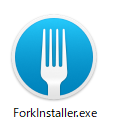
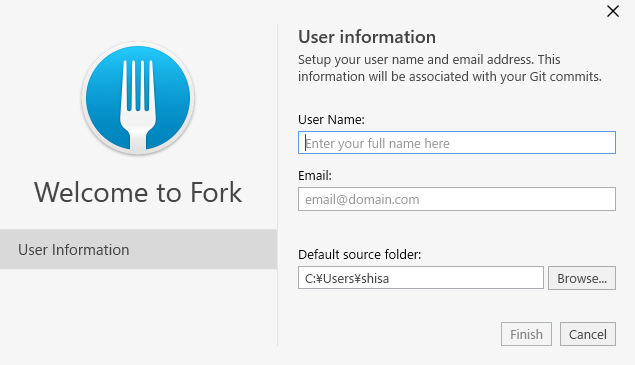
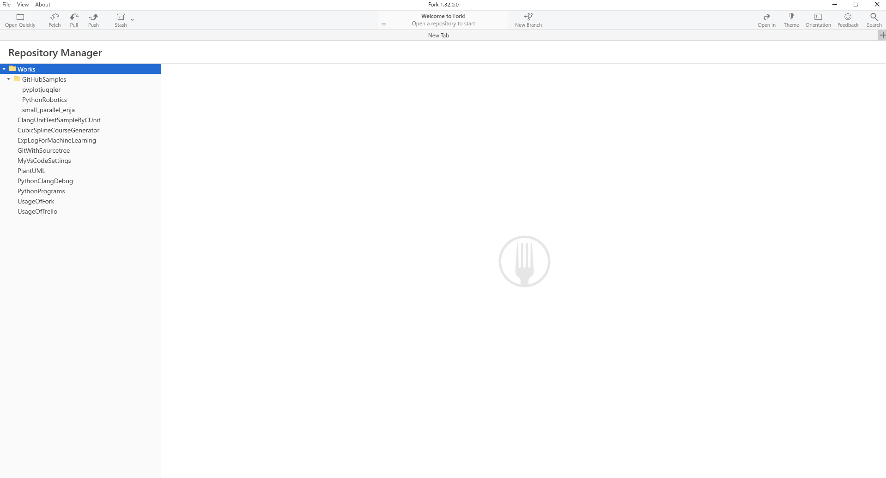
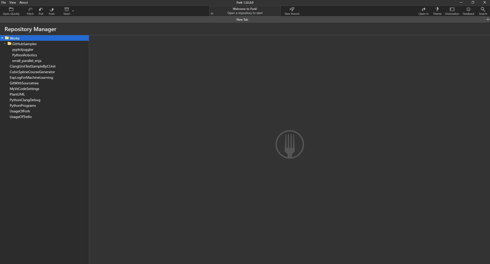
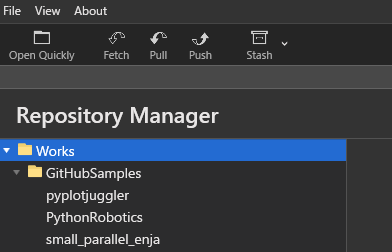
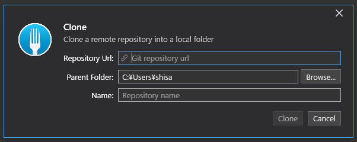
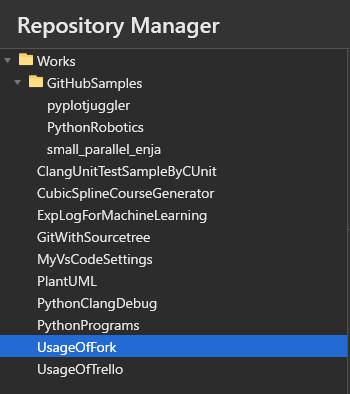
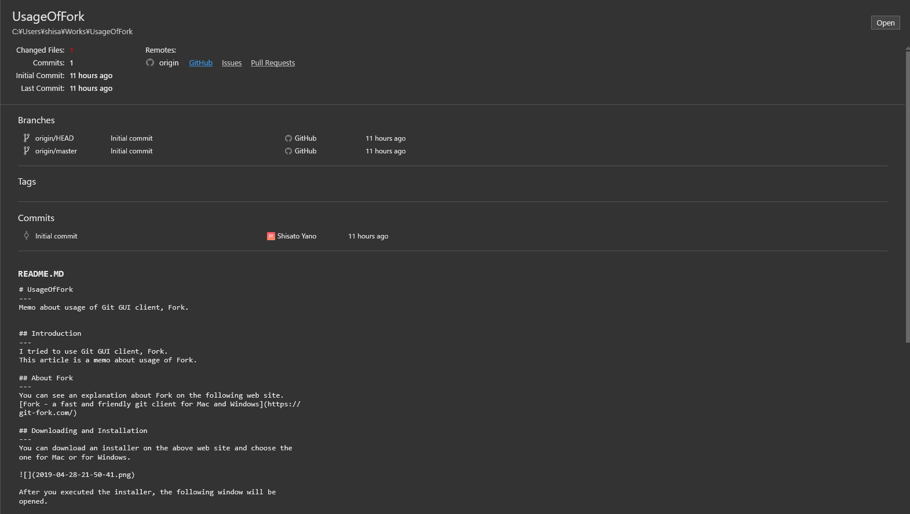
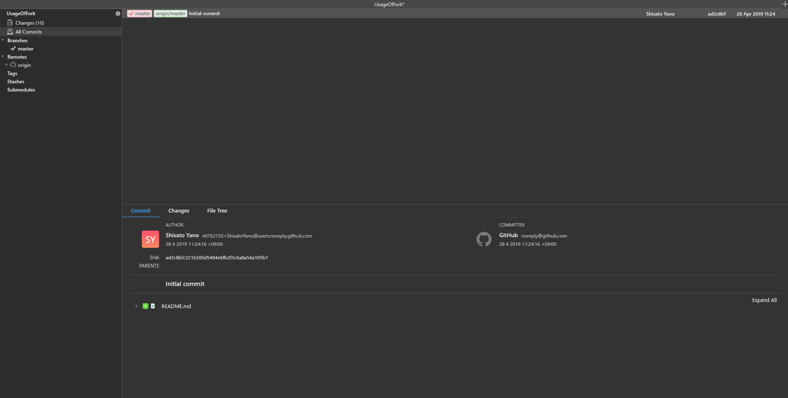

# UsageOfFork
---
Memo about usage of Git GUI client, Fork.

## Introduction
---
I tried to use Git GUI client, Fork.  
This article is a memo about usage of Fork.  

## About Fork
---
You can see an explanation about Fork on the following web site.  
[Fork - a fast and friendly git client for Mac and Windows](https://git-fork.com/)

## Downloading and Installation
---
You can download an installer on the above web site and choose the one for Mac or for Windows.  

After you executed the installer, the following window will be opened.  

On this window, you need to enter your full name as user name and your e-mail address.  
Finally, you need to select source folder and push 'Finish' button.  

## GUI
---
GUI of Fork is this.  

There are 2 kinds of color theme, white and black. You can switch the color by pushing 'Theme' button as follow. The button is located on the upper right of GUI.  

The black color theme is as follow.  

## Clone
---
Open 'File' menue on the upper left of GUI and select 'Clone'.  

After 'Clone' was selected, the following window will be opened. You need to enter Repository URL, Parent folder and Repository name. Finally, you need to push 'Clone' button.  

## Repository Manager
---
On the left side of GUI, Git repositories in your PC like this.  

When you chose a repository, the informations about the repository will be displayed as follow.  

By pushing 'Open' button on the upper right, GUI will be switched to the one for staging and committing as follow.  

## Commit
---
