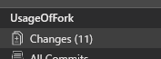
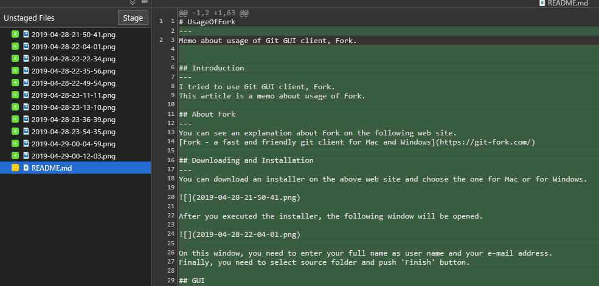
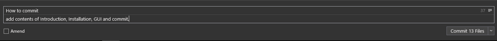
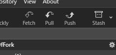
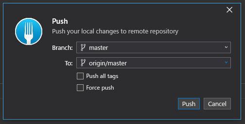
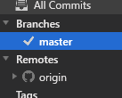
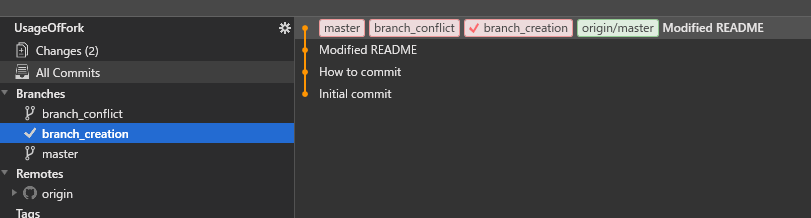
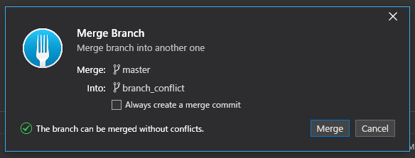

# UsageOfFork
---
Memo about usage of Git GUI client, Fork.

## Introduction
---
I tried to use Git GUI client, Fork.  
This article is a memo about usage of Fork.  

## About Fork
---
You can see an explanation about Fork on the following web site.  
[Fork - a fast and friendly git client for Mac and Windows](https://git-fork.com/)

## Downloading and Installation
---
You can download an installer on the above web site and choose the one for Mac or for Windows.  

After you executed the installer, the following window will be opened.  

On this window, you need to enter your full name as user name and your e-mail address.  
Finally, you need to select source folder and push 'Finish' button.  

## GUI
---
GUI of Fork is this.  

There are 2 kinds of color theme, white and black. You can switch the color by pushing 'Theme' button as follow. The button is located on the upper right of GUI.  

The black color theme is as follow.  

## Clone
---
Open 'File' menue on the upper left of GUI and select 'Clone'.  

After 'Clone' was selected, the following window will be opened. You need to enter Repository URL, Parent folder and Repository name. Finally, you need to push 'Clone' button.  

## Repository Manager
---
On the left side of GUI, Git repositories in your PC like this.  

When you chose a repository, the informations about the repository will be displayed as follow.  

By pushing 'Open' button on the upper right, GUI will be switched to the one for staging and committing as follow.  

## Commit
---
You can see all of files which are changed and uncommitted by choosing 'Changes' on the left side menue.  

After 'Changes' was chosen, all of unstaged files are displayed as follow. The changed of each file are displayed by choosing the file.

When you want to commit them, you need to select files you want to commit and push 'Stage' button on unstaged files GUI. After that, you can enter commit subject, description and push 'Commit ~ Files' button on the lower right of GUI.  

## Push
---
'Push' button is located on the upper left of GUI as follow.  

You can see the following window by pushing 'Push' button. You can push the commited files to a remote repository on this window.  

## Branch creation
---
You can see all of branches on the left of GUI. In the following figure, a current checked out branch is master branch. When you create a new branch, you need to do right click on the original branch and select 'Create New Brach...' menue.  

For example, 2 new branches are created and displayed on the GUI like this.  

## Merge Branch
---
Firstly, you need to check out working branch. And then, you need to right click on the merge branch and select 'Merge into ~'. You can see the following Merge Branch window and can merge those branches.  
